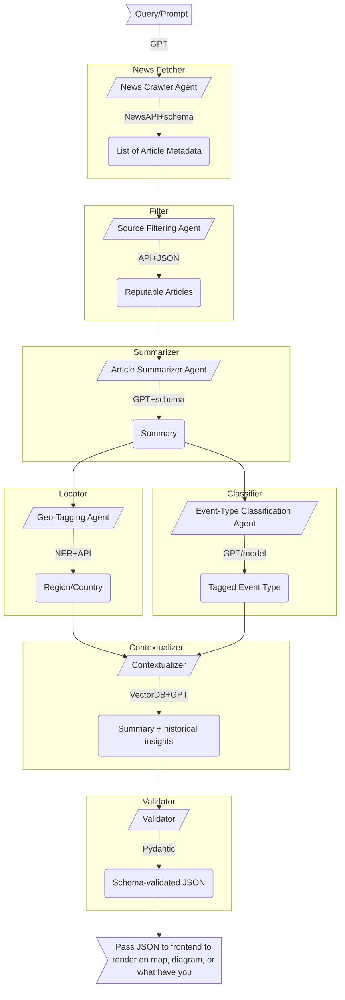

```mermaid
flowchart TD

query>Query/Prompt]

subgraph News Fetcher
news[/News Crawler Agent/]
articles(List of Article Metadata)
end

subgraph Filter
filter[/Source Filtering Agent/]
filtered(Reputable Articles)
end

subgraph Summarizer
summarizer[/Article Summarizer Agent/]
summary(Summary)
end

subgraph Classifier
classifier[/Event-Type Classification Agent/]
tag(Tagged Event Type)
end

subgraph Locator
mapper[/Geo-Tagging Agent/]
countries(Region/Country)
end

subgraph Contextualizer
context[/Contextualizer/]
history(Summary + historical insights)
end

subgraph Validator
validator[/Validator/]
schema(Schema-validated JSON)
end

query--GPT-->news
news--NewsAPI+schema-->articles
articles-->filter
filter--API+JSON-->filtered
filtered-->summarizer
summarizer--GPT+schema-->summary
summary-->classifier
classifier--GPT/model-->tag
summary-->mapper
mapper--NER+API-->countries
countries-->context
tag-->context
context--VectorDB+GPT-->history
history-->validator
validator--Pydantic-->schema
schema-->stop

stop>Pass JSON to frontend to render on map, diagram, or what have you]


```