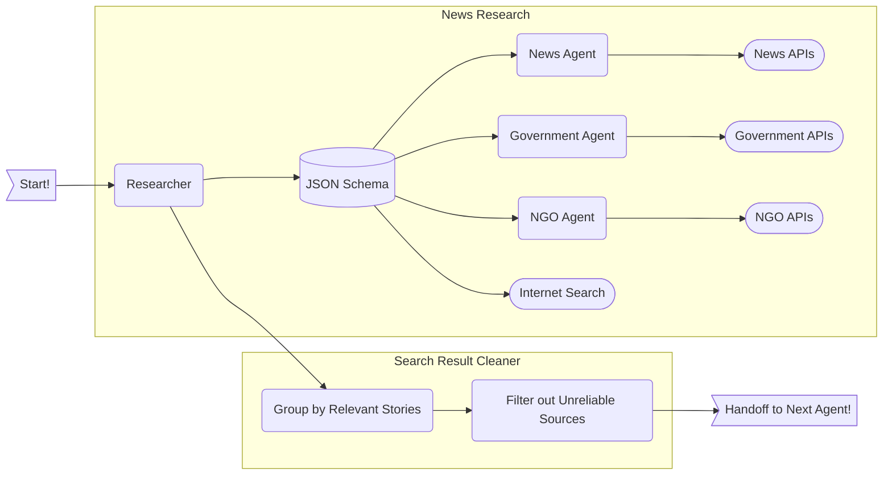

```mermaid
flowchart LR

subgraph News Research
    search(Researcher)
    news(News Agent)
    napis([News APIs])
    gov(Government Agent)
    gapi([Government APIs])
    ngo(NGO Agent)
    napi([NGO APIs])
    internet([Internet Search])
    schema[(JSON Schema)]
end

subgraph Search Result Cleaner
    grouper(Group by Relevant Stories)
    filter(Filter out Unreliable Sources)
end


start>Start!]
stop>Handoff to Next Agent!]


start-->search
schema-->news
news-->napis
schema-->gov
gov-->gapi
schema-->internet
schema-->ngo
search-->grouper
ngo-->napi
grouper-->filter
filter-->stop
search-->schema
```